<div align="center">

  <!-- Logo -->
  

  <!-- Titolo + Slogan nello stesso blocco -->
  <h1 style="background: linear-gradient(180deg, #fff 30%, #00eaff 100%);
             -webkit-background-clip: text; -webkit-text-fill-color: transparent;
             font-size: 6rem; font-weight: 900; margin: 0; line-height: 1;
             letter-spacing: -5px; font-family: 'Segoe UI', Roboto, Helvetica, Arial, sans-serif;
             text-transform: uppercase;
             filter: drop-shadow(0 8px 20px rgba(0, 234, 255, 0.5));">
    𝗟𝗘𝗩𝗜𝗔𝗧𝗛𝗔𝗡<br>
    <span style="font-size: 1.5rem; letter-spacing: 2px; text-shadow: 0 0 10px rgba(0, 234, 255, 0.5);">
      ⚡ L'abisso si risveglia ⚡
    </span>
  </h1>


<br>

<!-- 🚀 Badge principali -->
<p>
  
  
  
  
</p>

<!-- 💻 Stack e status -->
<p>
  
  
  
  
</p>

<br>

<!-- 🟦 Box descrittivo -->
<div style="background: #050a10; border: 1px solid rgba(0, 234, 255, 0.15); border-radius: 8px; padding: 25px; width: 85%; max-width: 800px; box-shadow: 0 10px 30px rgba(0,0,0,0.5);">
  <strong style="font-size: 1.3rem; color: #00eaff; display: block; margin-bottom: 10px;">
    🇮🇹 Engineered for Italian Content Precision
  </strong>
  <span style="color: #cbd5e1; line-height: 1.6; font-size: 1rem;">
    Leviathan ridefinisce lo standard dei metamotori torrent con un'architettura <b>Italy-First</b>.  
    Integra:
    <ul style="margin: 10px 0 0 20px; padding: 0;">
      <li>Sistema di validazione semantica dei titoli</li>
      <li>Gestione automatizzata delle challenge WAF</li>
      <li>Algoritmo di routing a bassa latenza per risultati immediati</li>
      <li>Integrazione IO per automazioni, notifiche e sincronizzazioni</li>
    </ul>
  </span>
</div>

<br>

<!-- ⚡ Funzionalità chiave -->
<p>
  
  
  
  
  
</p>


<div align="center">
  <a href="https://leviathanaddon.dpdns.org" target="_blank">
    
  </a>

<div align="center">
  <a href="https://leaviathan-leviathan.hf.space">
    
  </a>
</div>
  
  <br>

  <hr style="width: 40%; border: 0; height: 1px; background: linear-gradient(90deg, transparent, #00eaff, transparent); margin-top: 15px; opacity: 0.4;">
</div>

## ⚡ Architettura del Sistema

> **Leviathan trascende il concetto di scraper tradizionale.** È un motore di aggregazione predittivo progettato per navigare ecosistemi torrent complessi, restituendo dataset puliti, validati e ordinati per rilevanza.

Il core, sviluppato in **Node.js**, orchestra scansioni parallele sui principali index mondiali e italiani. Utilizza una logica proprietaria per distinguere le sorgenti in base alla latenza di risposta, applicando timeout dinamici e tecniche di evasione anti-bot.

### 🔥 Release 2.0 Highlights

* 🚀 **Core Refactoring:** Motore riscritto per massimizzare stabilità e concorrenza.
* 🌪️ **VIX Hybrid Module:** Integrazione diretta con **StreamingCommunity** per flussi istantanei (No-P2P).
* 👻 **Ghost Proxying:** Supporto nativo a **MediaFlow** per l'uso sicuro di Account Debrid condivisi.
* 🔗 **AIOStreams:** Supporto nativo per flussi AIOStreams, integrato nel motore Leviathan.
* 🏎️ **Fast Lane Mode:** Gestione intelligente dei timeout per API ad alta velocità.
* 🇮🇹 **Strict ITA Validation:** Filtri regex chirurgici per l'eliminazione dei falsi positivi.
* 🛡️ **Cloudscraper Integration:** Ottimizzazione avanzata per il superamento dei controlli Cloudflare.
* 💉 **Magnet Injection:** Arricchimento automatico dei metadati con tracker UDP Tier-1.

---

## 🔱 Core Capabilities

> Il sistema si distingue per un approccio algoritmico proprietario che privilegia la **precisione semantica** sulla forza bruta.

### 1. 🇮🇹 ITA-Strict Validation Protocol
L'algoritmo `isItalianResult()` non esegue una semplice ricerca di stringhe. Applica un filtro **semantico** che analizza il payload per garantire la pertinenza.
* **Positive Matching:** Targetizza tag specifici come `AC3`, `DTS`, `MULTI`, `SUB-ITA`.
* **False Positive Kill-Switch:** Elimina automaticamente release `CAM`, `TS`, e fake files o re-encode di bassa qualità.
* **Risultato:** Dataset pulito al 99.9%. Se non è italiano, non passa.

### 2. ⚡ Adaptive Latency Architecture
Leviathan non tratta tutte le sorgenti allo stesso modo. Utilizza un'euristica predittiva per modulare i timeout:
* 🟢 **Fast Lane (3000ms):** Canale prioritario per API JSON e indici ottimizzati *(Knaben, TPB, Corsaro)*.
* 🔵 **Deep Scan (5000ms):** Scansione profonda per portali HTML complessi o protetti *(1337x, Galaxy)*.
* *Il sistema bilancia automaticamente velocità e completezza.*

### 3. 🛡️ Advanced WAF Evasion
Un layer di sicurezza integrato gestisce l'interazione con i sistemi di protezione perimetrale (Web Application Firewalls).
* **Cloudflare Bypass:** Risoluzione automatica delle challenge JS tramite `cloudscraper`.
* **Identity Rotation:** Rotazione dinamica degli `User-Agent` per simulare traffico organico.
* **Resilience:** Fallback intelligenti che scartano i nodi morti senza interrompere il ciclo di ricerca.

### 4. 🧬 Metadata Fusion & Tracker Injection
Non si limita a trovare il link. Lo potenzia.
* **Smart Parsing:** Normalizzazione regex per Stagioni/Episodi (`S01E01`, `1x01`) indipendentemente dal formato sorgente.
* **Magnet Boosting:** Inietta nel payload una lista curata di **Tracker UDP Tier-1** *(OpenTrackr, Quad, Lubitor)* per massimizzare la velocità di aggancio dei peer e ridurre il tempo di pre-buffering.

### 5. 🌪️ VIX Hybrid Protocol (StreamingCommunity)
Leviathan evolve oltre il Torrent. Il modulo **VIX** interroga direttamente l'infrastruttura di StreamingCommunity.
* **Direct HLS Extraction:** Aggancia i flussi video m3u8 direttamente dalla sorgente web.
* **Zero-Wait:** Nessun buffering iniziale, nessun bisogno di seeders. Il contenuto parte istantaneamente.
* **Fallback Intelligente:** Se il torrent non ha seed, il sistema commuta automaticamente sul flusso web.

### 6. 👻 Debrid Ghost Shell (MediaFlow Proxy)
Progettato per l'elusione dei blocchi IP e la gestione di account Multi-Utente.
* **IP Masking:** Tutto il traffico verso Real-Debrid viene tunnelizzato tramite **MediaFlow Proxy**.
* **Shared Account Support:** Permette l'utilizzo dello stesso account Debrid su più IP contemporaneamente senza rischiare il ban, poiché il provider vede solo l'IP del Proxy.
* **Anti-Throttling:** Bypassa i blocchi imposti dagli ISP sui domini dei servizi Debrid.

---

<div align="center">

<br>

<div align="center">
  <div style="background: rgba(245, 166, 35, 0.1); border: 1px solid rgba(245, 166, 35, 0.3); border-radius: 6px; padding: 15px; width: 90%; max-width: 800px;">
    <strong style="color: #F5A623; font-size: 0.9rem; display: block; margin-bottom: 5px;">
      ⚠️ RESTRIZIONE ALLDEBRID
    </strong>
    <span style="color: #cbd5e1; font-size: 0.85rem;">
      Per motivi di policy del servizio <b>AllDebrid</b>, il servizio è supportato
      <b>esclusivamente tramite Self-Hosting casalingo</b>.
      <br>
      L’istanza pubblica non è compatibile con AllDebrid: per garantire
      autenticazione corretta, stabilità delle sessioni e continuità del servizio
      è necessario un <b>deploy locale (Docker su rete domestica)</b>.
    </span>
  </div>
</div>

## 🌐 LEVIATHAN NETWORK NODES

<br>

| **TARGET ENGINE** | **REGION** | **LATENCY** | **MODE** | **STATUS** |
| :--- | :---: | :---: | :---: | :---: |
| **StreamingCommunity** | 🇮🇹 ITA |  |  | 🟢 |
| **Il Corsaro Nero** | 🇮🇹 ITA |  |  | 🟢 |
| **Knaben** | 🌍 GLB |  |  | 🟢 |
| **The Pirate Bay** | 🌍 GLB |  |  | 🟢 |
| **UIndex** | 🌍 GLB |  |  | 🟢 |
| **SolidTorrents** | 🌍 GLB |  |  | 🟢 |
| **Nyaa** | 🇯🇵 JPN |  |  | 🟢 |
| **TorrentGalaxy** | 🌍 GLB |  |  | 🟢 |
| **BitSearch** | 🌍 GLB |  |  | 🟢 |
| **LimeTorrents** | 🌍 GLB |  |  | 🟢 |
| **Torrentz2** | 🌍 GLB |  |  | 🟢 |
| **RARBG** | 🌍 GLB |  |  | 🟢 |
| **1337x** | 🌍 GLB |  |  | 🟢 |

<br>


---
# 🐳 PROTOCOLLO DI DISTRIBUZIONE

<div align="center">

Il modo più veloce e pulito per eseguire Leviathan in locale o in produzione.

[](https://www.docker.com/)
[](https://www.stremio.com/)

### 💠 Sequenza di Avvio Rapido

Copia l'intera sequenza e incollala nel terminale per l'inizializzazione immediata:
</div>

```bash
                         git clone https://github.com/LUC4N3X/stremio-leviathan-addon
                  cd stremio-leviathan-addon
                  docker compose up -d --build 
```
✅ Fatto! Leviathan sarà raggiungibile su:
http://localhost:7000


> [!TIP]
> **Status Operativo:**
> * ✔️ **Full Auto:** Avvio completamente automatizzato senza intervento umano.
> * ✔️ **Zero Config:** Nessuna configurazione manuale complessa richiesta.
> * ✔️ **High Performance:** Ideale per Server VPS, NAS e ambienti Home Lab 24/7.

---

## ⚖️ Disclaimer Legale & Termini di Servizio (EULA)

> [!CAUTION]
> **AVVISO CRITICO DI CONFORMITÀ LEGALE**
> L'accesso, l'installazione e l'esecuzione del codice contenuto in questo repository costituiscono l'accettazione incondizionata delle seguenti clausole di esclusione della responsabilità.

### 1. 🛡️ Natura Agnostica e Neutralità Tecnologica
**Leviathan** è definito tecnicamente come un *Web Scraper User-Agent* e un *Framework di Indicizzazione Distribuita*.
Il software opera secondo il principio della **Neutralità Tecnologica**:
* **Funzione Esclusiva:** Il codice agisce come un interprete automatizzato di linguaggi di markup (HTML/XML/JSON). La sua funzione è limitata all'estrazione di stringhe di testo (metadati) da sorgenti pubbliche definite dall'utente.
* **Assenza di Hosting:** Leviathan **NON** ospita, **NON** trasmette, **NON** memorizza e **NON** indicizza sui propri server alcun contenuto protetto da diritto d'autore (Video, Audio, Binari).
* **Non-Interferenza:** Il software non possiede capacità intrinseche di decriptazione (DRM bypass), elusione di misure tecnologiche di protezione o accesso abusivo a sistemi informatici.

### 2. 🧪 Finalità di Ricerca e Sviluppo (R&D)
Il presente repository è pubblicato sotto licenza Open Source con finalità strettamente limitate a:
* **Proof of Concept (PoC):** Dimostrazione teorica di algoritmi di scraping ed estrazione dati.
* **Interoperabilità:** Studio delle interazioni tra protocolli di rete decentralizzati e client multimediali.
* **Analisi Forense:** Test di sicurezza e analisi del traffico web in ambienti controllati (Sandboxed Environment).

### 3. 🚫 Limitazione di Responsabilità e Manleva (Indemnification)
L'autore (**LUC4N3X**), i contributori e i maintainer del progetto non esercitano alcun controllo, monitoraggio o supervisione sull'utilizzo del software da parte dell'utente finale.

**L'Utente Finale dichiara e garantisce che:**
1.  **Utilizzo Autonomo:** L'utilizzo del software avviene a proprio esclusivo rischio e pericolo su infrastrutture locali o private.
2.  **Conformità Giurisdizionale:** L'utente si assume l'onere di verificare che l'uso di Leviathan sia conforme alle leggi vigenti nel proprio territorio (inclusi, ma non limitati a: DMCA 17 U.S.C. § 512, Direttiva Copyright UE 2019/790).
3.  **Esonero di Responsabilità:** L'utente accetta di manlevare, indennizzare e tenere indenne lo sviluppatore da qualsiasi rivendicazione, azione legale, sanzione o richiesta di risarcimento danni derivante dall'uso improprio, illecito o non autorizzato del codice.

### 4. 🏴‍☠️ Politica Zero-Tolerance sulla Pirateria
Il software è progettato per l'indicizzazione di contenuti di pubblico dominio (Public Domain) o licenziati liberamente (Creative Commons).
**Qualsiasi utilizzo volto alla violazione del copyright, alla pirateria digitale o alla distribuzione non autorizzata di proprietà intellettuale è severamente proibito.**
Lo sviluppatore condanna fermamente la pirateria e non fornirà supporto tecnico a configurazioni volte a tale scopo.

---

> **CLAUSOLA RISOLUTIVA ESPRESSA**
> Se non concordi con anche solo una delle clausole sopra esposte, o se la legislazione del tuo paese non consente tale limitazione di responsabilità, non sei autorizzato a utilizzare questo software.
>
> **⚠️ INTERROMPI L'ESECUZIONE, ELIMINA IL CONTAINER E DISTRUGGI IL CODICE SORGENTE IMMEDIATAMENTE.**
>
> ... altrimenti ...

👁‍🗨 BENVENUTO NELL'ABISSO.
---


<div align="center">

  
  

  <br><br>

  <a href="https://www.paypal.me/luc4nex" target="_blank">
    
  </a>

  <br><br>

  

  <br><br>


<h3><span class="notranslate">🧬 PROJECT CORE & NEURAL NETWORK</span></h3>
  
  <table style="border: none;">
    <tr>
      <td align="center" width="200px" style="border: none; vertical-align: top;">
        <a href="https://github.com/LUC4N3X">
          
          <br><b>LUC4N3X</b>
        </a>
        <br><br>
        <sub style="color: #8b949e;">Architect & Core<br>Fondatore del protocollo</sub>
      </td>
      
  <td align="center" width="200px" style="border: none; vertical-align: top;">
        <a href="https://github.com/qwertyuiop8899">
          
          <br><b>qwertyuiop8899</b>
        </a>
        <br><br>
        <sub style="color: #8b949e;">Supporto costante, debug strategico e logica chiave del external-addons.js</sub>
      </td>
      
  <td align="center" width="200px" style="border: none; vertical-align: top;">
        <a href="https://github.com/diogomiguel93">
          
          <br><b>diogomiguel93</b>
        </a>
        <br><br>
        <sub style="color: #8b949e;">Base e ispirazione per l’integrazione dell’addon Torrentio(ITA)</sub>
      </td>
    </tr>
  </table>
  
  <br>
  <sub style="color: grey;">Leviathan Project © 2025 • Evolution Guaranteed</sub>

</div>
